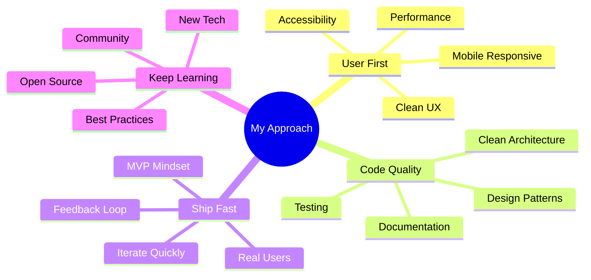
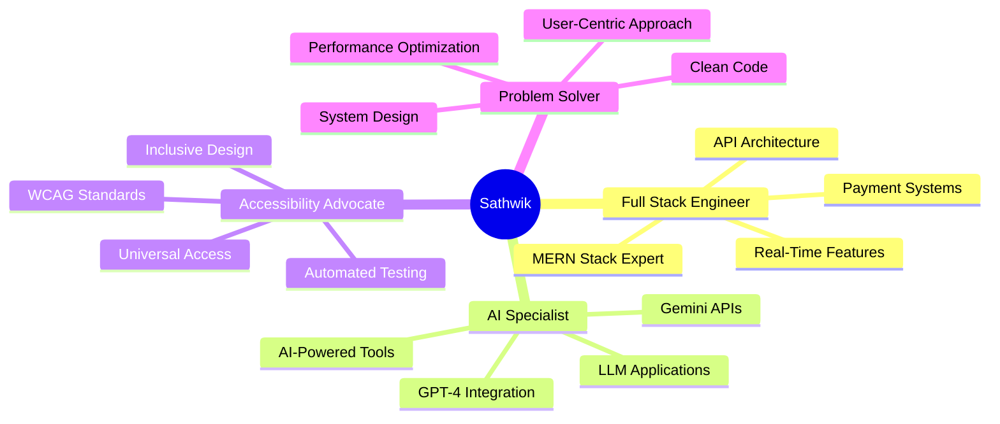

<div align="center">

<!-- ANIMATED HEADER -->


<!-- TYPING ANIMATION -->
<p>
  <a href="https://git.io/typing-svg">
    
  </a>
</p>

<!-- BADGES -->
<p>
  
  
  
</p>

<!-- ANIMATED GIF OR BANNER -->


</div>

---

## 🎯 **About Me**

```typescript
const sathwik = {
    location: "Bengaluru, India 🇮🇳",
    education: {
        degree: "B.Tech in Computer Science",
        university: "Manipal Institute of Technology",
        cgpa: "8.9/10",
        graduation: "May 2027"
    },
    current_role: "Intern @ ISRO",
    
    expertise: [
        "Full Stack Development (MERN/MEVN)",
        "AI Integration & LLM Applications", 
        "Web Accessibility (WCAG)",
        "Real-Time Systems & WebSockets",
        "Cloud Architecture & DevOps"
    ],
    
    currentlyWorking: [
        "Vue.js accessibility widget with WCAG compliance",
        "AI-powered code review platform",
        "Crowdfunding platform with Stripe integration",
        "Chrome extensions with AI capabilities"
    ],
    
    achievements: [
        "🏆 HACK'NIGHT 2025 Finalist",
        "🥇 1st Prize - State-Level Badminton",
        "📜 Meta Back-End Developer Certified",
        "☁️ AWS Cloud Practitioner Certified"
    ],
    
    askMeAbout: [
        "Full-stack architecture & system design",
        "AI/LLM integration in web apps",
        "Payment gateway integrations",
        "Web accessibility & WCAG standards",
        "Chrome extension development"
    ],
    
    funFact: "Built 5+ production apps while maintaining 8.9 CGPA 📚💻"
};
```

---

## 🎨 **Interactive Experience Zones**

<table>
<tr>
<td width="50%">

### 💼 **Professional Experience**
```yaml
🔥 Kritno (Aug 2025 - Dec 2025):
  Role: Software Engineer Intern
  Impact:
    - Vue.js accessibility widget
    - Automated WCAG compliance
    - Playwright visual auditing
    - Reusable component library
  
🎪 Falak Fest (Feb 2024 - May 2025):
  Role: Technical Committee Member
  Impact:
    - 500+ user registrations
    - 99.9% uptime
    - 20% fewer issues
```

</td>
<td width="50%">

### 🚀 **Featured Projects**
```yaml
💰 Crowd Connect:
  Stack: MERN + Stripe
  Features: Campaign CRUD, RBAC, JWT
  
🏥 Smart Meds:
  Stack: React + FastAPI + PostgreSQL
  Features: GPT-4 chatbot, ADR monitoring
  
🧠 CodeGuardian AI:
  Stack: React + Gemini + Firebase
  Features: AI PR reviews, repo chat
  
⚡ LeetMate:
  Stack: React + Chrome API
  Features: AI solutions, Gen Z style
```

</td>
</tr>
</table>

<details>
<summary><b>📚 My Development Philosophy (Click to Expand)</b></summary>
<br>



**Core Principles:**
- 🎯 Build with purpose - Every feature must solve a real problem
- 🚀 Ship quality - Production-ready code, not just demos
- 🔄 Iterate based on feedback - Real users drive real improvements
- 📚 Share knowledge - Documentation and clean code matter
- 🌟 Accessibility first - Technology should be inclusive

</details>

---

## 🛠️ **Tech Arsenal**

<div align="center">

### **Frontend Development**


### **Backend & APIs**


### **Databases & Storage**


### **AI & Integrations**


### **DevOps & Tools**


</div>

---

## 📊 **GitHub Analytics**

<div align="center">
  


</div>

---

## 🏆 **GitHub Trophies**

<div align="center">
  
[](https://github.com/ryo-ma/github-profile-trophy)

</div>

---

## 🎮 **Interactive Code Timeline**

<div align="center">

### **My Development Journey — Click to Travel Through Time** ⏰

<details>
<summary><b>🚀 2025: Professional Software Engineering</b></summary>

```diff
+ Software Engineer Intern @ Kritno
+ Building enterprise accessibility solutions
+ Automated WCAG compliance systems
+ Vue.js component architecture at scale
@ Technologies: Vue.js, Playwright, WCAG, DOM APIs
```

**Key Achievement:** Developed production-ready accessibility widget deployed across multiple client platforms

**Skills Gained:** Web accessibility, automated testing, enterprise-grade component design

</details>

<details>
<summary><b>🏆 2024-2025: Hackathons & Community Leadership</b></summary>

```diff
+ HACK'NIGHT 2025 Finalist
+ Technical Committee Member @ Falak Fest
+ Managed 500+ user registrations
+ 99.9% uptime during high-traffic events
@ Technologies: MERN Stack, Payment Gateways, High-Availability Systems
```

**Key Achievement:** Led technical team to reduce user issues by 20% during major event

**Skills Gained:** Team leadership, production system management, payment integrations

</details>

<details>
<summary><b>💡 2023-2024: AI Integration & Full Stack Mastery</b></summary>

```diff
+ Built AI-powered hospital management system
+ Integrated GPT-4, Gemini APIs in production apps
+ Developed crowdfunding platform with Stripe
+ Created Chrome extensions with AI capabilities
@ Technologies: React, FastAPI, OpenAI, Gemini, PostgreSQL, Stripe
```

**Key Achievement:** Shipped 5+ production-grade full-stack applications with real users

**Skills Gained:** AI/LLM integration, payment systems, real-time features, scalable architecture

</details>

<details>
<summary><b>🎯 2022-2023: Foundation & Web Development</b></summary>

```diff
+ Started B.Tech at Manipal Institute of Technology
+ Mastered MERN stack fundamentals
+ Built first full-stack projects
+ Learned system design & databases
@ Technologies: JavaScript, React, Node.js, MongoDB, Git
```

**Key Achievement:** Established strong foundation in full-stack development

**Skills Gained:** Web fundamentals, REST APIs, database design, version control

</details>

<details>
<summary><b>📚 2021-2022: Programming Foundations</b></summary>

```diff
+ Class XII with 97.9%
+ Started with C programming & DSA
+ Explored web development basics
+ First exposure to problem-solving
@ Technologies: C, HTML, CSS, JavaScript basics
```

**Key Achievement:** 97.9% in Class XII while learning to code

**Skills Gained:** Programming fundamentals, problem-solving mindset, self-learning ability

</details>

</div>

---

## 🎲 **Fun Interactive Stats**

<div align="center">

<table>
<tr>
<td width="50%" align="center">

### 🔥 **This Week I'm...**

```javascript
const currentMode = {
  working: "Accessibility Solutions 🎨",
  learning: "Advanced System Design 🏗️",
  building: "AI-Powered Tools 🤖",
  vibing: "Full Stack Mode 🚀",
  
  coffeeLevel: "████████░░ 80%",
  productivityMode: "MAXIMUM 💯",
  
  nextMilestone: "Graduate & Join Top Tech 🎯"
};
```

</td>
<td width="50%" align="center">

### 📊 **By The Numbers**

```yaml
🎓 CGPA: 8.9/10
🏆 Hackathon Finals: 1
👥 Users Served: 500+
💼 Internships: 2
📦 Projects Shipped: 10+
☕ Coffee Consumed: ∞
🐛 Bugs Fixed: More than created
💡 Ideas in Pipeline: Always growing
```

</td>
</tr>
</table>

### **🎨 My Engineering Philosophy**



</div>

---

## 🎯 **Choose Your Adventure**

<div align="center">

| 🤖 **AI/ML Projects?** | 🌐 **Full Stack Apps?** | ♿ **Accessibility?** |
|:--:|:--:|:--:|
| Explore GPT-4, Gemini<br>& LLM Integrations | Check MERN Stack<br>& Payment Systems | See WCAG Compliance<br>& Automated Testing |
| [View Projects →](https://github.com/sathwik13198?tab=repositories) | [View Projects →](https://github.com/sathwik13198?tab=repositories) | [View Projects →](https://github.com/sathwik13198?tab=repositories) |

</div>

> 💡 **Note:** All projects are production-grade with real users — not just demos or tutorials!

---

## 🎓 **Certifications & Achievements**

<div align="center">

| Certification | Issuer | Status |
|:--|:--:|:--:|
| 🏆 HACK'NIGHT 2025 Finalist | National Hackathon | ✅ Achieved |
| 🎯 Meta Back-End Developer Specialization | Meta | ✅ Certified |
| ☁️ AWS Cloud Practitioner | Amazon Web Services | ✅ Certified |
| 🐧 IBM Linux Fundamentals | IBM | ✅ Certified |
| ☕ Java & Object-Oriented Programming | Oracle | ✅ Certified |
| 🥇 State-Level Badminton Champion | State Sports | 🏆 1st Prize |

</div>

---

## 📬 **Let's Connect & Collaborate**

<div align="center">

### **I'm always open to interesting conversations and opportunities!**

[](https://sathwikpentapati.vercel.app/)
[](https://drive.google.com/file/d/1oUvgWXba5nALLia2sJioyk5JjK-p3OKC/view)
[](https://linkedin.com/in/sathwikpentapati/)
[](mailto:sathwikpentapati@gmail.com)

[](https://github.com/sathwik13198)
[](https://leetcode.com/VPTDJzmOny)
[](https://auth.geeksforgeeks.org/user/sathwikperqyc)
[](https://instagram.com/always__sathwik)

### **📱 Direct Contact**
```
📞 Phone: +91 9666713198
📧 Email: sathwikpentapati@gmail.com
📍 Location: Bengaluru, Karnataka, India
```

</div>

---

## 💬 **Ask Me Anything**

<div align="center">

**Got questions about:**

`Full Stack Development` • `AI/LLM Integration` • `Web Accessibility` • `MERN Stack` • `System Design` • `Career Advice` • `Hackathons`

<br>

**Open for:**

`💼 Internship Opportunities` • `🤝 Collaboration on Projects` • `🎤 Tech Talks & Workshops` • `📚 Mentorship`

<br>

**📩 Open an issue • 💬 Drop a message • 🤝 Let's connect**

### **I reply within 24 hours!** ⚡

</div>

---

## 🎨 **Random Dev Wisdom**

<div align="center">


</div>

---

<div align="center">

### **⭐ If my work inspires you, consider starring a repo!**
### **Every star motivates me to build more awesome stuff** 🚀


**Made with 💙 by Sathwik Pentapati**

</div>
