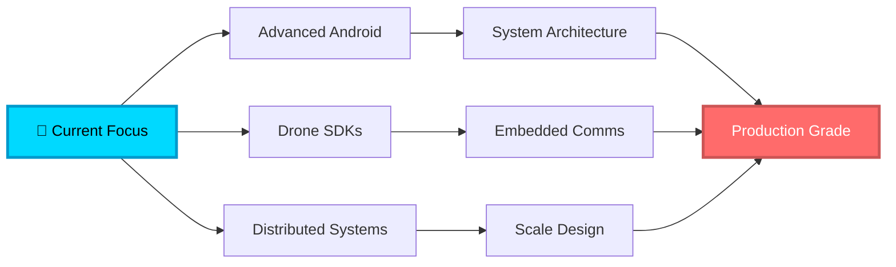

<div align="center">

<!-- ANIMATED HEADER -->


<!-- TYPING ANIMATION -->
<p>
  <a href="https://git.io/typing-svg">
    
  </a>
</p>

<!-- BADGES -->
<p>
  
  
  
</p>

<!-- ANIMATED GIF OR BANNER -->


</div>

---

## 🎯 **About Me**

```typescript
const sathwik = {
    location: "Hyderabad, India 🇮🇳",
    current_role: "Android & Drone Software Development Intern @ ISRO 🛰️",
    education: "B.Tech in Computer Science",
    passions: ["Android Architecture", "Real-Time Systems", "Drone Tech", "AI Integration"],
    
    currentlyWorking: [
        "Portable drone communication platforms",
        "Offline-first Android apps with Jetpack Compose",
        "MQTT/WebSocket real-time messaging",
        "AI-powered automation tools"
    ],
    
    askMeAbout: [
        "Android internals & Jetpack Compose",
        "Real-time communication protocols",
        "Drone SDKs & embedded systems",
        "Full-stack development",
        "System design"
    ],
    
    funFact: "I debug more than I sleep — and I genuinely enjoy it! 🐛💻"
};
```

---

## 🎨 **Interactive Experience Zones**

<table>
<tr>
<td width="50%">

### 🚧 **Current Projects**
```yaml
🔥 Active Development:
  - Offline Android Apps
  - Drone ↔ Android Systems
  - MQTT Messaging Pipelines
  - AI Automation Tools
  
🎯 Status: Building & Shipping
```

</td>
<td width="50%">

### 💡 **What Excites Me**
```yaml
❤️ Love Working On:
  - Android Architecture
  - Low-Latency Communication
  - Backend APIs
  - AI in Production
  - Real User Products
  
⚡ Mode: Always Learning
```

</td>
</tr>
</table>

<details>
<summary><b>📚 Current Learning Journey (Click to Expand)</b></summary>
<br>


```mermaid
graph LR
    A[🎯 Current Focus] --> B[Advanced Android]
    A --> C[Drone SDKs]
    A --> D[Distributed Systems]
    B --> E[System Architecture]
    C --> F[Embedded Comms]
    D --> G[Scale Design]
    E --> H[Production Grade]
    F --> H
    G --> H
    
    style A fill:#00D9FF,stroke:#0099CC,stroke-width:3px,color:#000
    style H fill:#FF6B6B,stroke:#CC5555,stroke-width:3px,color:#fff
```

**🗺️ Roadmap:**
- [ ] Master Android Internals & Performance Optimization
- [ ] Deep dive into Drone Communication Protocols
- [ ] Learn Distributed System Patterns
- [ ] Build Scalable System Architectures
- [ ] Contribute to Open Source Android Projects

</details>

---

## 🛠️ **Tech Arsenal**

<div align="center">

### **Mobile Development**


### **Backend & APIs**


### **Frontend**


### **Databases & Cloud**


### **Tools & Platforms**


</div>

---

## 📊 **GitHub Analytics**

<div align="center">
  


</div>

---

## 🏆 **GitHub Trophies**

<div align="center">
  
[](https://github.com/ryo-ma/github-profile-trophy)

</div>

---

## 🎯 **Choose Your Adventure**

<div align="center">

| 🤖 **Android Enthusiast?** | 🛰️ **Drone & IoT Fan?** | 🌐 **Full Stack Developer?** |
|:--:|:--:|:--:|
| Explore Jetpack Compose<br>& Architecture Projects | Check ISRO & Real-Time<br>Communication Work | Dive into MERN Stack<br>& AI Integrations |
| [View Repos →](https://github.com/sathwik13198?tab=repositories) | [View Repos →](https://github.com/sathwik13198?tab=repositories) | [View Repos →](https://github.com/sathwik13198?tab=repositories) |

</div>

> 💡 **Note:** All projects are production-grade, end-to-end implementations — not demos!

---

## 📬 **Let's Connect**

<div align="center">

[](https://sathwikpentapati.vercel.app/)
[](https://drive.google.com/file/d/1oUvgWXba5nALLia2sJioyk5JjK-p3OKC/view)
[](https://linkedin.com/in/sathwikpentapati/)
[](mailto:sathwikpentapati@gmail.com)
[](https://instagram.com/always__sathwik)
[](https://leetcode.com/VPTDJzmOny)
[](https://auth.geeksforgeeks.org/user/sathwikperqyc)

</div>

---

## 💬 **Ask Me Anything**

<div align="center">

**Got questions about:**

`Android & Jetpack Compose` • `Real-Time Systems` • `Drone Tech` • `Full Stack` • `AI Projects` • `Career Advice`

<br>

**📩 Open an issue • 💬 Drop a message • 🤝 Let's connect**

### **I actually reply!** ✨

</div>

---

## 🎨 **Random Dev Quote**

<div align="center">


</div>

---

## 🐍 **Contribution Snake**

<div align="center">


</div>

---

<div align="center">

### **✨ If my work resonates with you, consider starring a repo — it genuinely motivates me! ✨**


</div>
